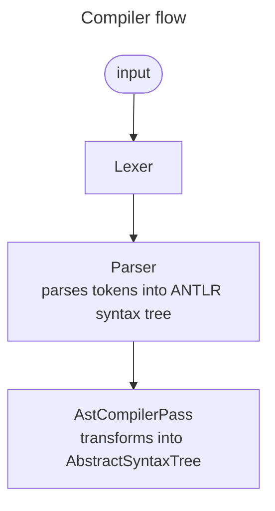
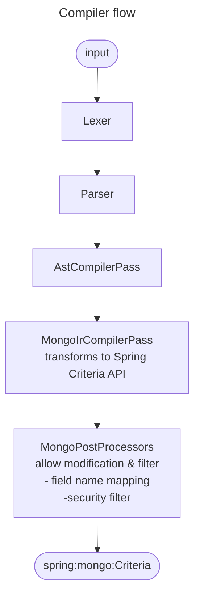

# Compiler architecture

## Base


### Example
1.  ```text
    @.type=="Cat" && @.tags[?@.name=="lovely"]
    ```
2.  ```mermaid
    ---
    title: Token stream
    ---
    flowchart LR
        1(["@"]) --> 2(["."])
        2 --> 3(["SAFE_IDENTIFIER: type"])
        3 --> 4(["COMPARISON_OPERATOR: =="])
        4 --> 5(["QUOTED_TEXT: &quot;Cat&quot;"])
        5 --> 6(["..."])
    ```
3.  ```mermaid
    ---
    title: ANTLR syntax tree
    ---
    flowchart TD
        above([...])
        above --> restComparisonQuery
    
        restComparisonQuery --> restComparisonQueryOmitted["..."]
        restComparisonQuery --> comparisonOperator["COMPARISON_OPERATOR: =="]
        restComparisonQuery --> literal["QUOTED_TEXT: &quot;Cat&quot;"]
    
        restComparisonQueryOmitted --> currentNode["@"]
        restComparisonQueryOmitted --> segment1[segment]
    
        segment1 --> literal1["."]
        segment1 --> shortHand[memberNameShortHand]
        shortHand --> type["SAFE_IDENTIFIER: type"]
    ```
4.  ```mermaid
    ---
    title: AST
    ---
    flowchart TD
        above([...])
        above --> RelativeValueComparingNode
    
        RelativeValueComparingNode --> queryNode["RelativeQueryNode"]
        RelativeValueComparingNode --> operator["Operator\n=="]
        RelativeValueComparingNode --> valueNode["ValueNode\nCat"]
    
        queryNode --> fieldSelectorNode["FieldSelectorNode\n type"]
    ```

## Spring Mongo


## Decision records

### ANTLRv4
**Issue**: We require lexer/parser logic.

**Decision**: We use ANTLRv4

**Constraints**: n/a

**Consequences**: Additional intermediate representation

#### Positions
- Familiarity with ANTLRv4
- Rapid prototyping
- Sound, hardened parsing
- Readable grammar, specification as code
- Tooling to understand and debug grammar